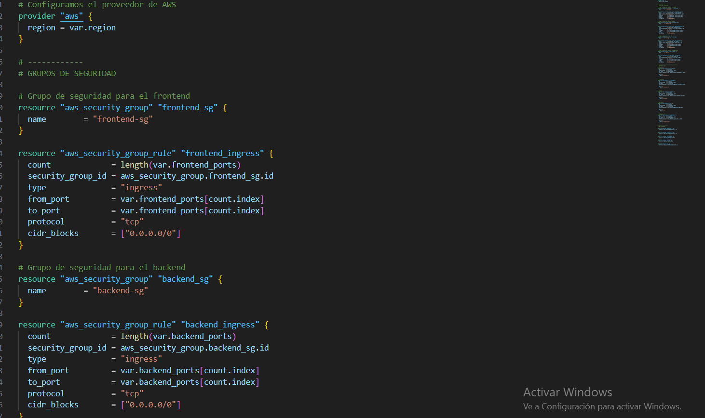
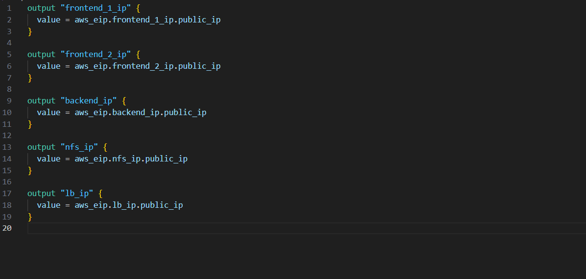
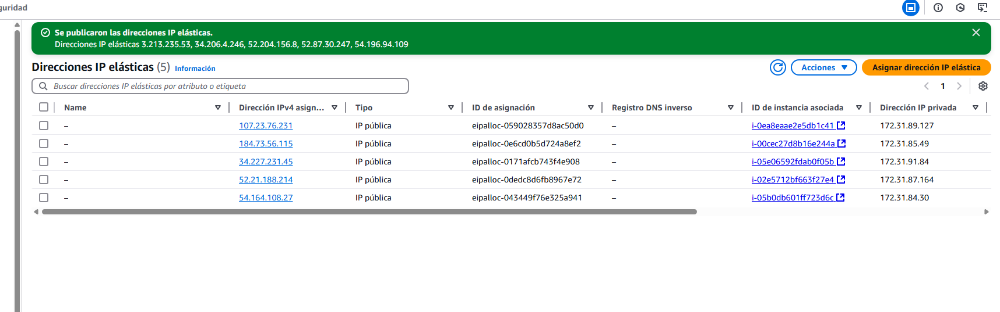

# practica-4.5

En esta práctica vamos a usar terraform para crear infraestructura de la práctica 11.
Para ello,usaremos los siguientes archivos:
main.tf
output.tf
variables.tf

en el main.tf tendremos lo siguiente:

En el archivo output: donde definiremos las salida de nuestra infraestructura,es decir los valores que nos mostrará cuando ejecutemos terraform apply. En este caso nos mostrará las ip públicas de las intancias creadas.

Por último,tendremos un archivo de variables,donde recogertemos los datos que vamos a introducir a la hora de crear nuestra infraestructura.

Una vez tengamos nuestros script o archivos de configuración,lo que tendremos que hacer para lanzarlo es hacer un terraform apply.
Si queremos ver los planes que terraform quiere llevar a cabo antes de ejecutar, podremos hacer un terraform plan.

Podemos acceder a nuestro amazon y ver como se ha creado la infraestructura.

Podemos ver que se han creado las instancias

Se crean los grupos

Se crean las ips elásticas
